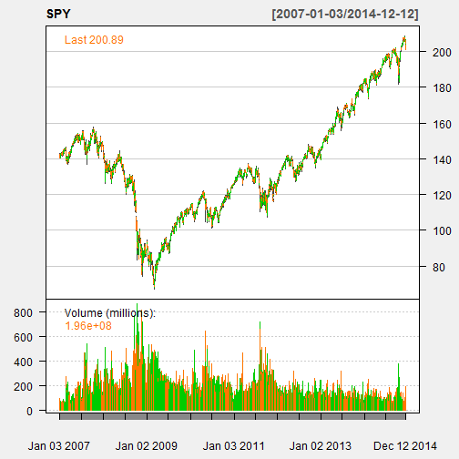

Stock Chart
========================================================
author: r0bschneider
date: 12/13/2014
transition: rotate

Viewed on: Sat Dec 13 11:29:59 2014

The Reality of Investing
========================================================
 - Investors are not always rational in the way they set expectations and ***predict market direction***
 - ***Price changes*** themselves may be a better indicator to ***predict market direction***
 - Historically Investors that have used ***price charts*** and ***price patterns*** as tools for predicting future price movements have seen greater returns over the long term


"Stock Chart" is All You Need 
========================================================
"Stock Chart" integrates historic price and technicals to identify patterns and implement your stategies
 - Market pricing or all markets * 
 - Market prices for any period
 - Latest technical indicators available
 - Various Charting Techniques
 
<small>* Stockprices provided by ***yahoo***</small>

"Stock Chart" in Action
========================================================


```
[1] "SPY"
```

 

About
========================================================
This application is made as a project for my Coursera course: Developing Data Products in the  data science specialization.

It provides Historical Stock Charts and Technicals, which provide investors more useful information to predict stock movement over time.

The code was written in R and hosted by shiny apps at 
https://r0bschneider.shinyapps.io/DDPShinyApp/

<small>Pleae visit our repository at: https://github.com/r0bschneider/DevDataProducts</small>
